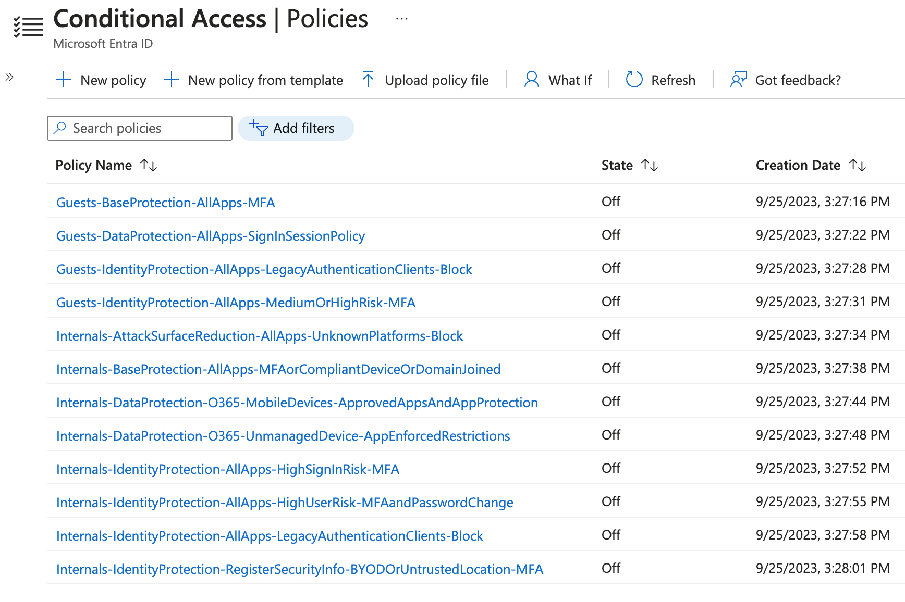

# Microsoft Graph - PowerShell SDK Examples

Identity and Access Management of Entra ID (Azure AD) via the PowerShell SDK for Microsoft Graph.

## Prerequisite
[PowerShell SDK for Microsoft Graph](https://github.com/microsoftgraph/msgraph-sdk-powershell)
```powershell
Install-Module Microsoft.Graph -AllowClobber -Force
```
Optionally, also install:
```powershell
Install-Module Microsoft.Graph.Beta -AllowClobber -Force
```

## Connect to Microsoft Graph

Using the Microsoft Graph Command Line Tools Enterprise Application
```powershell
Connect-MgGraph -Scopes @('')
```

Using an existing Access Token
```powershell
Connect-MgGraph -AccessToken (ConvertTo-SecureString 'ey..' -AsPlainText -Force)
```

Using an Application Registration (Platform: Mobile and desktop applications, redirect http://localhost)
```powershell
Connect-MgGraph -ClientId 'abc..' -TenantId 'abc..'
```

## Audit Logs
### [With Authentication Method Mismatch](/auditLogs/signIns/With%20Authentication%20Method%20Mismatch.ps1)
> This occurs when the authentication method by which the user authenticated with the service doesn't match the requested authentication method defined by the provider.

## Applications
### [Where Disabled or Invalid](/applications/Where%20Disabled%20or%20Invalid.ps1)
> Find Application Registrations that have been disabled or are missing their Enterprise Application instance.
### [With Credentials](/applications/With%20Credentials.ps1)
> Find Application Registrations with Password or Certificate Credentials.
### [With Certificate or Secret Expiry Status](/applications/With%20Certificate%20or%20Secret%20Expiry%20Status.ps1)
> Find Application Registration Certificate or Secret expiry status.
### [Without Owners](/applications//Without%20Owners.ps1)
> Find Application Registrations without assigned Owners.

## Service Principals
### [Add Microsoft Graph App Role Assignment](/servicePrincipals/Add%20Microsoft%20Graph%20App%20Roles.ps1)
> Adding a Microsoft Graph App Role to a Service Principal (Application/Managed Identity). ie. 'User.Read.All'
### [With AppRoles Assigned from AppId](/servicePrincipals/With%20AppRoles%20Assigned%20From%20AppId.ps1)
> Find all Enterprise Applications with the ability to consumer services in Microsoft Graph, AAD Graph and O365 API without a signed in user.
### [With SAML Expiry Status](/servicePrincipals/With%20SAML%20Expiry%20Status.ps1)
> Find SAML SSO expiry status on enabled Enterprise Applications.

## Azure Automation Account
### [Acquire Access Token for Microsoft Graph](/azure-automation-account/Connect%20To%20Microsoft%20Graph.ps1)
> Retrieve an Access Token for Microsoft Graph from an Azure AD Automation Account Managed Identity.

## Identity Protection
### [Confirm User Compromised](/identityProtection/Confirm%20User%20Compromised.ps1)
> Confirm one or more riskyUser objects as compromised. This action sets the targeted user's risk level to high.

## Groups
### [Cloud Only](/groups/Cloud%20Only.ps1)
> Find all cloud only groups (those not synchronised from AD on-premises).

## Users
### [Cloud Only](users/Cloud%20Only.ps1)
> Find all cloud only accounts.
### [Guests](users/Guests.ps1)
> Find all Guest accounts.
### [Last Sign In Activity](users/Last%20Sign%20In%20Activity.ps1)
> Find the last sign-in activity of an account.
### [Members](users/Members.ps1)
> Find all Member accounts.
### [Password Change](/users/Password%20Change.ps1)
> Make a cloud or on-premises user change their password on their next sign-in to Azure. This cannot be used in conjunction with Passthrough Authentication.
### [Where Assigned Licenses](users/With%20Assigned%20Licenses.ps1)
> Find all accounts assigned licenses.
### [Where Email Address Is Value](users/Where%20Email%20Address%20Is%20Value.ps1)
> Find Member account by email address.
### [Where On-Premises Extension Attribute Is Value](users/Where%20AD%20onPremisesExtensionAttribute%20Is%20Value.ps1)
> Find all Member accounts by on-premises extensionAttribute.
### [Where UserPrincipalName Starts With](/users/Where%20UserPrincipalName%20Starts%20With.ps1)
> Find accounts by User Principal Name prefix.


## Conditional Access

### [Policies](identity/conditional%20access/Policies.ps1)
> Find all Conditional Access Policies.

### Templates

Zero Trust Persona-based Azure AD Conditional Access Policies



Based upon the excellent [Microsoft Learn: Conditional Access architecture and personas](https://learn.microsoft.com/en-us/azure/architecture/guide/security/conditional-access-architecture) and [Framework and policies](https://learn.microsoft.com/en-us/azure/architecture/guide/security/conditional-access-framework) pages authored by [Claus Jespersen](https://www.linkedin.com/in/claus-jespersen-25b0422/).

> Note that for clarity, I have deviated to the following naming convention: <br> **Persona**-**PolicyType**-**App/User Action**-**Condition**-**AccessControl**<br>

<small>*This collection is a work in progress*.</small>

To deploy, simply create the persona groups in the Azure AD tenant and copy their object ids to the 'config.json' file, together with any break-glass user object ids.

Conditional Access Policies as code.

#### [Guests-BaseProtection-AllApps-MFA](/identity/conditional%20access/templates/Guests-BaseProtection-AllApps-MFA.ps1)
> Guests must perform MFA.
#### [Guests-DataProtection-AllApps-SignInSessionPolicy](/identity/conditional%20access/templates/Guests-DataProtection-AllApps-SignInSessionPolicy.ps1)
> Guests sign-in for a limited time.
#### [Guests-IdentityProtection-AllApps-LegacyAuthenticationClients-Block](/identity/conditional%20access/templates/Guests-IdentityProtection-AllApps-LegacyAuthenticationClients-Block.ps1)
> Guests blocked from legacy authentication.
#### [Guests-IdentityProtection-AllApps-MediumOrHighRisk-MFA](/identity/conditional%20access/templates/Guests-IdentityProtection-AllApps-MediumOrHighRisk-MFA.ps1)
> Guests with Medium or High Risk always perform MFA.
#### [Internals-AttackSurfaceReduction-AllApps-UnknownPlatforms-Block](/identity/conditional%20access/templates/Internals-AttackSurfaceReduction-AllApps-UnknownPlatforms-Block.ps1)
> Internals must use known device platforms.
#### [Internals-BaseProtection-AllApps-MFAorCompliantDeviceOrDomainJoined](/identity/conditional%20access/templates/Internals-BaseProtection-AllApps-MFAorCompliantDeviceOrDomainJoined.ps1)
> Internals must perform MFA or be using a compliant device OR be using a domain joined device.
#### [Internals-DataProtection-O365-MobileDevices-ApprovedAppsAndAppProtection](/identity/conditional%20access/templates/Internals-DataProtection-O365-MobileDevices-ApprovedAppsAndAppProtection.ps1)
> Internals accessing Office 365 via mobile devices must use Approved Apps or App Protection Policies.
#### [Internals-DataProtection-O365-UnmanagedDevice-AppEnforcedRestrictions](/identity/conditional%20access/templates/Internals-DataProtection-O365-UnmanagedDevice-AppEnforcedRestrictions.ps1)
> Internals accessing Office 365 on unmanaged devices must use App Enforced Restrictions. These (defined within SharePoint and Exchange) may limit the user experience.
#### [Internals-IdentityProtection-AllApps-HighSignInRisk-MFA](/identity/conditional%20access/templates/Internals-IdentityProtection-AllApps-HighSignInRisk-MFA.ps1)
> Internals with High Sign-In Risk must perform MFA.
#### [Internals-IdentityProtection-AllApps-HighUserRisk-MFAandPasswordChange](/identity/conditional%20access/templates/Internals-IdentityProtection-AllApps-HighUserRisk-MFAandPasswordChange.ps1)
> Internals with High User Risk must perform MFA and change their password.
#### [Internals-IdentityProtection-AllApps-LegacyAuthenticationClients-Block](/identity/conditional%20access/templates/Internals-IdentityProtection-AllApps-LegacyAuthenticationClients-Block.ps1)
> Internals blocked from legacy authentication.
#### [Internals-IdentityProtection-RegisterSecurityInfo-BYODOrUntrustedLocation-MFA](/identity/conditional%20access/templates/Internals-IdentityProtection-RegisterSecurityInfo-BYODOrUntrustedLocation-MFA.ps1)
> Internals blocked from registering security information (MFA) when on a BYOD device or in an untrusted Named Location.

## Red Team
### [Finding Global Administrators](/red-team/Finding%20Global%20Administrators.ps1)
> Find accounts with the Global Administrator role using an access token acquired for the Azure Portal (Entra).
### [Finding Single Page Applications with Passwords](/red-team/Finding%20SPAs%20with%20Passwords.ps1)
> Find Application Registrations for Single Page Applications that contain secrets.